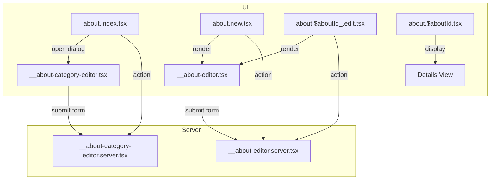

# About Me Dashboard Route & Editor Structure

This document describes the organization and relationships of the About Me dashboard feature in the codebase.

# AboutMe & AboutMeCategory: Data Model and Route Integration

## Data Model Relationship

In the Prisma schema, the relationship between `AboutMe` and `AboutMeCategory` is defined as a classic one-to-many association:

- **AboutMeCategory** (the category) can have many **AboutMe** (sections).
- Each **AboutMe** section belongs to exactly one **AboutMeCategory**.

**Prisma Schema Excerpt:**
```prisma
model AboutMeCategory {
  id        String   @id @default(cuid())
  name      String   @unique
  // ...
  aboutMes  AboutMe[]
}

model AboutMe {
  id                 String   @id @default(cuid())
  // ...
  aboutMeCategoryId  String
  aboutMeCategory    AboutMeCategory @relation(fields: [aboutMeCategoryId], references: [id], onDelete: Cascade, onUpdate: Cascade)
}
```
- The `aboutMeCategoryId` foreign key on `AboutMe` enforces this link.
- The `aboutMes` field on `AboutMeCategory` provides access to all sections in that category.

## How This Relation Is Applied in the Dashboard Routes

- **Listing:**
  The main dashboard (`about.index.tsx`) fetches and displays all AboutMe sections, grouped or filtered by their associated category. This enables users to see which sections belong to which categories at a glance.

- **Filtering:**
  The AboutMe sections table supports filtering by category. This is implemented by querying AboutMe records with a specific `aboutMeCategoryId`, leveraging the Prisma relation.

- **Details & Editing:**
  - The details page (`about.$aboutId.tsx`) displays the category name for each AboutMe section by accessing the related `aboutMeCategory`.
  - The editor form (`__about-editor.tsx`) allows users to select a category for a section. When editing, the current category is pre-selected, and on save, the `aboutMeCategoryId` is updated.

- **Category CRUD:**
  - Creating or editing a category (via the dialog in `about.index.tsx`) updates the available categories for all AboutMe sections.
  - Deleting a category will cascade and affect all associated AboutMe sections, as enforced by the Prisma relation.

## Example: Data Flow

- When a user creates or edits an AboutMe section, the form includes a dropdown of all available AboutMeCategories.
- On submission, the selected category's ID is saved as `aboutMeCategoryId` in the AboutMe record.
- When displaying a section, the UI joins the AboutMe record with its AboutMeCategory to show the category name.

**Summary Table:**

| AboutMe Field         | AboutMeCategory Field | Usage in UI/Routes                |
|----------------------|----------------------|-----------------------------------|
| aboutMeCategoryId    | id                   | Foreign key for relation          |
| aboutMeCategory.name | name                 | Displayed in details/list/editor  |
| aboutMeCategory      | aboutMes             | Used for grouping/filtering       |

---

## Route File Overview

```bash
app/routes/dashboard+/
├── about.index.tsx
├── about.new.tsx
├── about.$aboutId.tsx
├── about.$aboutId_.edit.tsx
├── __about-editor.tsx
├── __about-editor.server.tsx
├── __about-category-editor.tsx
├── __about-category-editor.server.tsx
```

---

### 1. List Page: `about.index.tsx`

- **Purpose:** Main dashboard for About Me sections and categories.
- **Features:**
  - Lists all About Me sections and categories for the user.
  - Provides filtering and sorting.
  - Opens the category editor dialog for create/edit.
- **Data Loading:** Loader fetches all sections and categories.
- **Actions:** Handles category CRUD via `handleCategoryAction` (imported from `__about-category-editor.server.tsx`).

#### Data Table Features

The About Me dashboard list page displays two data tables:

- **About Me Sections Table**
- **About Me Categories Table**

Both tables are built with the following interactive features:

##### About Me Sections Table

- **Filtering:**
  - By content
  - By category
- **Switch Form:**
  - Toggle published status for each section using a switch component. This submits a form to update the status immediately.
- **Menu-Driven Actions:**
  - Edit: Navigates to the edit page for the selected section.
  - Delete: Submits a form to delete the section, with a confirmation prompt.
- **Row Link:**
  - The section name is a link to the details page for that section.

##### About Me Categories Table

- **Filtering:**
  - By name
  - By description
- **Switch Form:**
  - Toggle published status for each category using a switch component. This submits a form to update the status immediately.
- **Menu-Driven Actions:**
  - Edit: Opens a dialog for editing the selected category.
  - Delete: Submits a form to delete the category, with a confirmation prompt.
- **Dialog-Driven Editing:**
  - Creating or editing a category opens a modal dialog with the category editor form.

##### Data Table Features Summary

| Table                    | Filtering Fields         | Switch (Publish) | Menu Actions (Edit/Delete) | Edit Method         |
|-------------------------|-------------------------|------------------|---------------------------|---------------------|
| About Me Sections       | Content, Category       | Yes              | Edit (link), Delete       | Edit page           |
| About Me Categories     | Name, Description       | Yes              | Edit (dialog), Delete     | Dialog (modal form) |

These features provide a rich, interactive experience for managing both About Me sections and their categories directly from the dashboard list page.

#### Intent Constants for Actions

The `about.index.tsx` file defines a `DashboardAboutIntent` constant object to standardize all intent values used in form submissions and server-side action handling. This approach ensures consistency and type safety across the UI and server logic.

**Example:**

```ts
export const DashboardAboutIntent = {
 ABOUT_ME_DELETE: 'about-me-delete',
 ABOUT_ME_CREATE: 'about-me-create',
 ABOUT_ME_UPDATE: 'about-me-update',
 ABOUT_ME_PUBLISH_TOGGLE: 'about-me-publish-toggle',
 CATEGORY_CREATE: 'category-create',
 CATEGORY_UPDATE: 'category-update',
 CATEGORY_DELETE: 'category-delete',
 CATEGORY_PUBLISH_TOGGLE: 'category-publish-toggle',
} as const
```

These constants are referenced throughout the data table action forms and switches, for example:

```tsx
<input type="hidden" name="intent" value={DashboardAboutIntent.ABOUT_ME_PUBLISH_TOGGLE} />
<button type="submit" name="intent" value={DashboardAboutIntent.ABOUT_ME_DELETE}>Delete</button>
```

On the server, the action function uses these constants in a switch statement to determine which operation to perform:

```ts
switch (intent) {
  case DashboardAboutIntent.CATEGORY_CREATE:
    // ...
  case DashboardAboutIntent.ABOUT_ME_DELETE:
    // ...
  // etc.
}
```

**Benefits:**

- Prevents typos and mismatches between client and server intent values.
- Makes it easy to update or add new actions in a single place.
- Improves maintainability and type safety for all About Me dashboard actions.

---

### 2. Create Page: `about.new.tsx`

- **Purpose:** Create a new About Me section.
- **Features:** Renders the `AboutEditor` form with empty/default values.
- **Data Loading:** Loader fetches all published categories for selection.
- **Actions:** Uses `action` from `__about-editor.server.tsx` for create.

---

### 3. Details Page: `about.$aboutId.tsx`

- **Purpose:** Read-only details for a single About Me section.
- **Features:**
  - Displays all fields for the section, including category and status.
  - Uses `EntityDetailsLinks` to provide both a Back link (to the About Me list) and an Edit link (to the edit page for the current section).
  - The section name is rendered as an `<h1>` for semantic structure and accessibility.
  - Details are shown in an `EntityDetailsCard`, with each field as a labeled value:
    - **Content**: The main content of the About Me section.
    - **Description**: The description, or "No description" if not present.
    - **Category**: The name of the associated category.
    - **Status**: Whether the section is "Published" or "Draft".
- **Data Loading:** Loader fetches the section by ID for the current user.

#### Example Structure

```tsx
<EntityDetailsLinks backLabel="Back to Abouts" />
<h1 className="text-2xl font-bold">{aboutMe.name}</h1>
<EntityDetailsCard id="about-details-card">
  <CardDetailsItem label="Content">
    <CardDetailsValue variant="prose">{aboutMe.content}</CardDetailsValue>
  </CardDetailsItem>
  <CardDetailsItem label="Description">
    <CardDetailsValue variant="prose">{aboutMe.description ?? 'No description'}</CardDetailsValue>
  </CardDetailsItem>
  <CardDetailsItem label="Category">
    <CardDetailsValue>{aboutMe.aboutMeCategory.name}</CardDetailsValue>
  </CardDetailsItem>
  <CardDetailsItem label="Status">
    <CardDetailsValue>{aboutMe.isPublished ? 'Published' : 'Draft'}</CardDetailsValue>
  </CardDetailsItem>
</EntityDetailsCard>
```

#### Details Page Summary Table

| Component              | Purpose/Usage                                                                 |
|------------------------|-------------------------------------------------------------------------------|
| EntityDetailsLinks     | Renders "Back" and "Edit" links for navigation.                               |
| h1                     | Displays the About Me section's name as the main heading.                     |
| EntityDetailsCard      | Container for the details list.                                               |
| CardDetailsItem/Value  | Renders each field (Content, Description, Category, Status) as label/value.   |

---

### 4. Edit Page: `about.$aboutId_.edit.tsx`

- **Purpose:** Edit an existing About Me section.
- **Features:** Renders the `AboutEditor` form pre-filled with section data.
- **Data Loading:** Loader fetches the section and all published categories.
- **Actions:** Uses `action` from `__about-editor.server.tsx` for update/delete.

---

### 5. Shared Editor Components

#### `__about-editor.tsx`

- **Purpose:** React component for the About Me section editor form.
- **Usage:** Used by both `about.new.tsx` and `about.$aboutId_.edit.tsx`.
- **Features:** Handles form state, validation, and submission for create/update/delete.

#### `__about-editor.server.tsx`

- **Purpose:** Server action handler for About Me section create, update, and delete.
- **Usage:** Exported as `action` in both new and edit routes.

#### `__about-category-editor.tsx`

- **Purpose:** React component for the About Me category editor dialog.
- **Usage:** Used in `about.index.tsx` for category create/edit.
- **Features:** Handles form state, validation, and submission for category CRUD.

#### `__about-category-editor.server.tsx`

- **Purpose:** Server action handler for About Me category create, update, and delete.
- **Usage:** Used in `about.index.tsx` via `handleCategoryAction`.

---

## Data Flow Diagram



---

## Best Practices

- **Colocation:** Editor components and server logic are colocated with route files for maintainability.
- **Reusability:** Shared editor components are used across new/edit pages and dialogs.
- **Type Safety:** Types are imported from `+types` files for strong typing (not shown in this tree).
- **Separation of Concerns:** UI, data loading, and server actions are clearly separated.

---

## Summary Table

| File                          | Purpose                                 | UI/Server | Used By                        |
|-------------------------------|-----------------------------------------|-----------|-------------------------------|
| about.index.tsx               | List sections & categories              | UI        | Entry point                   |
| about.new.tsx                 | Create new section                      | UI        | Entry point                   |
| about.$aboutId.tsx            | Section details (read-only)             | UI        | Entry point                   |
| about.$aboutId_.edit.tsx      | Edit section                            | UI        | Entry point                   |
| __about-editor.tsx            | Section editor form                     | UI        | new, edit routes              |
| __about-editor.server.tsx     | Section create/update/delete handler     | Server    | new, edit routes              |
| __about-category-editor.tsx   | Category editor dialog                  | UI        | index route                   |
| __about-category-editor.server.tsx | Category CRUD handler               | Server    | index route                   |

---

## Notes

- All About Me section and category CRUD operations are handled via forms and server actions, not client-side state.
- The structure supports easy extension for new features (e.g., more fields, validation, or additional routes).
