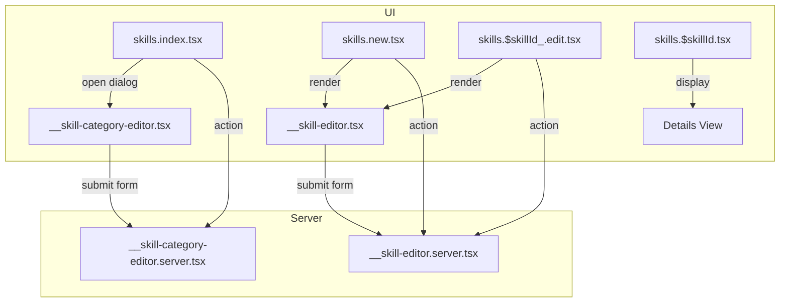

# Skills Dashboard Route & Editor Structure

This document describes the organization and relationships of the Skills dashboard feature in the codebase. It is based on the architecture of the "About Me" feature.

# Skill & SkillCategory: Data Model and Route Integration

## Data Model Relationship

In the Prisma schema, the relationship between `Skill` and `SkillCategory` is a one-to-many association:

- **SkillCategory** can have many **Skills**.
- Each **Skill** belongs to exactly one **SkillCategory**.

**Prisma Schema Excerpt:**
```prisma
model SkillCategory {
  id        String   @id @default(cuid())
  name      String   @unique // e.g., "Frontend", "Backend", "DevOps", "Other"
  isPublished Boolean @default(true)
  // ...
  skills Skill[]
}

model Skill {
  id              String   @id @default(cuid())
  name            String   @unique
  description     String?
  icon            String?
  isPublished     Boolean @default(true)
  // ...
  user   User   @relation(fields: [userId], references: [id], onDelete: Cascade, onUpdate: Cascade)
  userId String

  skillCategoryId String
  skillCategory   SkillCategory @relation(fields: [skillCategoryId], references: [id], onDelete: Cascade, onUpdate: Cascade)

  projects Project[] @relation("ProjectSkills")
}
```
- The `skillCategoryId` foreign key on `Skill` enforces this link.
- The `skills` field on `SkillCategory` provides access to all skills in that category.

## How This Relation Is Applied in the Dashboard Routes

- **Listing:** The main dashboard (`skills.index.tsx`) will fetch and display all Skills, grouped or filtered by their associated category.
- **Filtering:** The Skills table will support filtering by category, implemented by querying Skill records with a specific `skillCategoryId`.
- **Details & Editing:**
  - The details page (`skills.$skillId.tsx`) will display the category name for each Skill.
  - The editor form (`__skill-editor.tsx`) will allow users to select a category for a Skill.
- **Category CRUD:**
  - Creating, editing, or deleting a category will be handled via a dialog in `skills.index.tsx`.

---

## Route File Overview

```bash
app/routes/dashboard+/
├── skills.index.tsx
├── skills.new.tsx
├── skills.$skillId.tsx
├── skills.$skillId_.edit.tsx
├── __skill-editor.tsx
├── __skill-editor.server.tsx
├── __skill-category-editor.tsx
├── __skill-category-editor.server.tsx
```

---

### 1. List Page: `skills.index.tsx`

- **Purpose:** Main dashboard for Skills and Skill Categories.
- **Features:**
  - Lists all Skills and Skill Categories for the user in separate data tables.
  - Provides filtering and sorting for both tables.
  - Opens the category editor dialog for create/edit operations.
- **Data Loading:** Loader will fetch all skills and skill categories.
- **Actions:** Will handle Skill and Skill Category CRUD operations.

#### Data Table Features

- **Skills Table:**
  - **Filtering:** By name, description, and category.
  - **Switch Form:** Toggle published status.
  - **Menu-Driven Actions:** Edit (navigates to edit page), Delete (with confirmation).
  - **Row Link:** Skill name links to the details page.
- **Skill Categories Table:**
  - **Filtering:** By name and description.
  - **Switch Form:** Toggle published status.
  - **Menu-Driven Actions:** Edit (opens dialog), Delete (with confirmation).
  - **Dialog-Driven Editing:** Clicking a category name or "Edit" opens a modal dialog.

#### Intent Constants for Actions

An intent constant object (e.g., `DashboardSkillIntent`) will be used to manage form actions, similar to the "About Me" feature.

---

### 2. Create Page: `skills.new.tsx`

- **Purpose:** Create a new Skill.
- **Features:** Renders the `SkillEditor` form.
- **Data Loading:** Loader fetches all published categories for the selection dropdown.
- **Actions:** Uses `action` from `__skill-editor.server.tsx`.

---

### 3. Details Page: `skills.$skillId.tsx`

- **Purpose:** Read-only details for a single Skill.
- **Features:**
  - Displays all relevant fields: Name, Description, Icon, Category, and Status (Published/Draft).
  - Provides "Back" and "Edit" links.

---

### 4. Edit Page: `skills.$skillId_.edit.tsx`

- **Purpose:** Edit an existing Skill.
- **Features:** Renders the `SkillEditor` form pre-filled with skill data.
- **Data Loading:** Loader fetches the specific skill and all published categories.
- **Actions:** Uses `action` from `__skill-editor.server.tsx` for update/delete.

---

### 5. Shared Editor Components

- **`__skill-editor.tsx`:** The React component for the Skill editor form.
- **`__skill-editor.server.tsx`:** Server action handler for Skill create, update, and delete.
- **`__skill-category-editor.tsx`:** The React component for the Skill Category editor dialog.
- **`__skill-category-editor.server.tsx`:** Server action handler for Skill Category CRUD.

---

## Data Flow Diagram



---

## Playwright Test Suite Plan

The E2E test suite for this feature will adhere to the architecture defined in `my-docs/playwright-test-suite-architecture.md`.

### POM Directory Structure

```bash
tests/poms/dashboard/
├── skills-data-tables.pom.ts
├── skills-details-page.pom.ts
├── skills-editors.pom.ts
└── skills-list-page.pom.ts
```

### POM File Responsibilities

- **`skills-list-page.pom.ts`:** Manages the main skills dashboard page, composing the two data table POMs.
- **`skills-data-tables.pom.ts`:** Defines composable POMs for the Skills table and the Skill Categories table, using mixins for filtering, switching, and menu/dialog actions.
- **`skills-editors.pom.ts`:** Contains POMs for the Skill editor (page) and Skill Category editor (dialog).
- **`skills-details-page.pom.ts`:** Manages the skill details page.

### Test File

- **`tests/e2e/skills-crud.test.ts`:** Contains the E2E tests covering the full CRUD lifecycle for both Skills and Skill Categories, using the POMs for all interactions.

---

## Summary Table

| File                             | Purpose                                 | UI/Server | Used By                        |
|----------------------------------|-----------------------------------------|-----------|-------------------------------|
| skills.index.tsx                 | List skills & categories                | UI        | Entry point                   |
| skills.new.tsx                   | Create new skill                        | UI        | Entry point                   |
| skills.$skillId.tsx              | Skill details (read-only)               | UI        | Entry point                   |
| skills.$skillId_.edit.tsx        | Edit skill                              | UI        | Entry point                   |
| __skill-editor.tsx               | Skill editor form                       | UI        | new, edit routes              |
| __skill-editor.server.tsx        | Skill create/update/delete handler      | Server    | new, edit routes              |
| __skill-category-editor.tsx      | Category editor dialog                  | UI        | index route                   |
| __skill-category-editor.server.tsx | Category CRUD handler                   | Server    | index route                   |